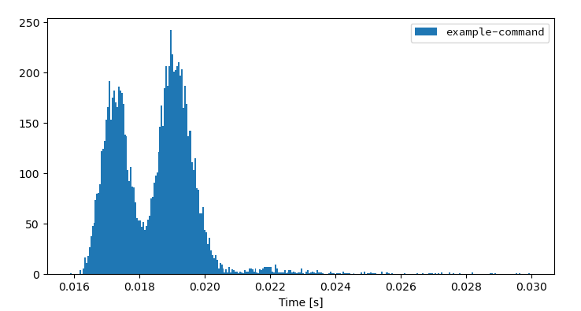
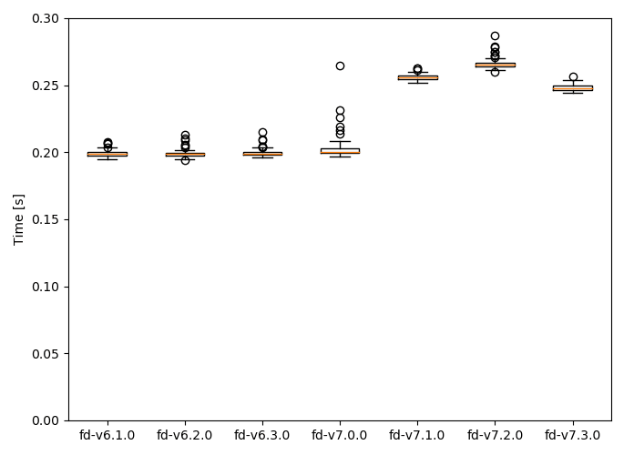
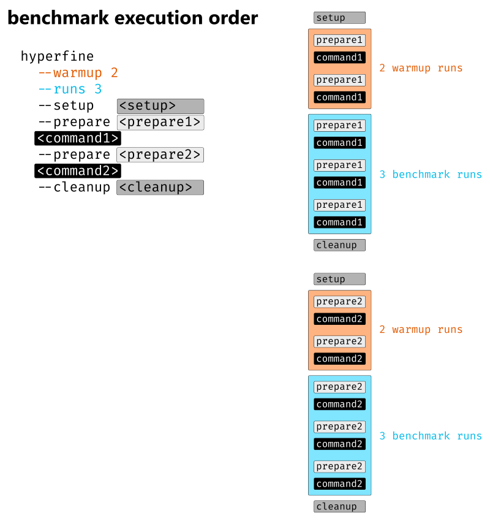

# hyperfine
[](https://github.com/sharkdp/hyperfine/actions/workflows/CICD.yml)
[](https://crates.io/crates/hyperfine)
[中文](https://github.com/chinanf-boy/hyperfine-zh)

A command-line benchmarking tool.

**Demo**: Benchmarking [`fd`](https://github.com/sharkdp/fd) and
[`find`](https://www.gnu.org/software/findutils/):


## Features

* Statistical analysis across multiple runs.
* Support for arbitrary shell commands.
* Constant feedback about the benchmark progress and current estimates.
* Warmup runs can be executed before the actual benchmark.
* Cache-clearing commands can be set up before each timing run.
* Statistical outlier detection to detect interference from other programs and caching effects.
* Export results to various formats: CSV, JSON, Markdown, AsciiDoc.
* Parameterized benchmarks (e.g. vary the number of threads).
* Cross-platform

## Usage

### Basic benchmarks

To run a benchmark, you can simply call `hyperfine <command>...`. The argument(s) can be any
shell command. For example:
``` bash
hyperfine 'sleep 0.3'
```

Hyperfine will automatically determine the number of runs to perform for each command. By default,
it will perform *at least* 10 benchmarking runs and measure for at least 3 seconds. To change this,
you can use the `-r`/`--runs` option:
``` bash
hyperfine --runs 5 'sleep 0.3'
```

If you want to compare the runtimes of different programs, you can pass multiple commands:
``` bash
hyperfine 'hexdump file' 'xxd file'
```

### Warmup runs and preparation commands

For programs that perform a lot of disk I/O, the benchmarking results can be heavily influenced
by disk caches and whether they are cold or warm.

If you want to run the benchmark on a warm cache, you can use the `-w`/`--warmup` option to
perform a certain number of program executions before the actual benchmark:
``` bash
hyperfine --warmup 3 'grep -R TODO *'
```

Conversely, if you want to run the benchmark for a cold cache, you can use the `-p`/`--prepare`
option to run a special command before *each* timing run. For example, to clear harddisk caches
on Linux, you can run
``` bash
sync; echo 3 | sudo tee /proc/sys/vm/drop_caches
```
To use this specific command with hyperfine, call `sudo -v` to temporarily gain sudo permissions
and then call:
``` bash
hyperfine --prepare 'sync; echo 3 | sudo tee /proc/sys/vm/drop_caches' 'grep -R TODO *'
```

### Parameterized benchmarks

If you want to run a series of benchmarks where a single parameter is varied (say, the number of
threads), you can use the `-P`/`--parameter-scan` option and call:
``` bash
hyperfine --prepare 'make clean' --parameter-scan num_threads 1 12 'make -j {num_threads}'
```
This also works with decimal numbers. The `-D`/`--parameter-step-size` option can be used
to control the step size:
``` bash
hyperfine --parameter-scan delay 0.3 0.7 -D 0.2 'sleep {delay}'
```
This runs `sleep 0.3`, `sleep 0.5` and `sleep 0.7`.

For non-numeric parameters, you can also supply a list of values with the `-L`/`--parameter-list`
option:
```
hyperfine -L compiler gcc,clang '{compiler} -O2 main.cpp'
```

### Intermediate shell

By default, commands are executed using a predefined shell (`/bin/sh` on Unix, `cmd.exe` on Windows).
If you want to use a different shell, you can use the `-S, --shell <SHELL>` option:
``` bash
hyperfine --shell zsh 'for i in {1..10000}; do echo test; done'
```

Note that hyperfine always *corrects for the shell spawning time*. To do this, it performs a calibration
procedure where it runs the shell with an empty command (multiple times), to measure the startup time
of the shell. It will then subtract this time from the total to show the actual time used by the command
in question.

If you want to run a benchmark *without an intermediate shell*, you can use the `-N` or `--shell=none`
option. This is helpful for very fast commands (< 5 ms) where the shell startup overhead correction would
produce a significant amount of noise. Note that you can not use shell syntax like `*` or `~` in this case.
```
hyperfine -N 'grep TODO /home/user'
```


### Shell functions and aliases

If you are using bash, you can export shell functions to directly benchmark them with hyperfine:

```
$ my_function() { sleep 1; }
$ export -f my_function
$ hyperfine my_function
```

If you are using a different shell, or if you want to benchmark shell aliases, you may try to put
them in a separate file:

```bash
echo 'my_function() { sleep 1 }' > /tmp/my_function.sh
echo 'alias my_alias="sleep 1"' > /tmp/my_alias.sh
hyperfine 'source /tmp/my_function.sh; eval my_function'
hyperfine 'source /tmp/my_alias.sh; eval my_alias'
```

### Exporting results

Hyperfine has multiple options for exporting benchmark results to CSV, JSON, Markdown and other
formats (see `--help` text for details).

#### Markdown 

You can use the `--export-markdown <file>` option to create tables like the following:

| Command | Mean [s] | Min [s] | Max [s] | Relative |
|:---|---:|---:|---:|---:|
| `find . -iregex '.*[0-9]\.jpg$'` | 2.275 ± 0.046 | 2.243 | 2.397 | 9.79 ± 0.22 |
| `find . -iname '*[0-9].jpg'` | 1.427 ± 0.026 | 1.405 | 1.468 | 6.14 ± 0.13 |
| `fd -HI '.*[0-9]\.jpg$'` | 0.232 ± 0.002 | 0.230 | 0.236 | 1.00 |

#### JSON

The JSON output is useful if you want to analyze the benchmark results in more detail. The
[`scripts/`](https://github.com/sharkdp/hyperfine/tree/master/scripts) folder includes a lot
of helpful Python programs to further analyze benchmark results and create helpful
visualizations, like a histogram of runtimes or a whisker plot to compare
multiple benchmarks:

|  |  |
|---:|---:|


### Detailed benchmark flowchart

The following chart explains the execution order of various timing runs when using options
like `--warmup`, `--prepare <cmd>`, `--setup <cmd>` or `--cleanup <cmd>`:



## Installation

[](https://repology.org/project/hyperfine/versions)

### On Ubuntu

Download the appropriate `.deb` package from the [Release page](https://github.com/sharkdp/hyperfine/releases)
and install it via `dpkg`:
```
wget https://github.com/sharkdp/hyperfine/releases/download/v1.13.0/hyperfine_1.13.0_amd64.deb
sudo dpkg -i hyperfine_1.13.0_amd64.deb
```

### On Fedora

On Fedora, hyperfine can be installed from the official repositories:

```sh
dnf install hyperfine
```

### On Alpine Linux

On Alpine Linux, hyperfine can be installed [from the official repositories](https://pkgs.alpinelinux.org/packages?name=hyperfine):
```
apk add hyperfine
```

### On Arch Linux

On Arch Linux, hyperfine can be installed [from the official repositories](https://www.archlinux.org/packages/community/x86_64/hyperfine/):
```
pacman -S hyperfine
```

### On Funtoo Linux

On Funtoo Linux, hyperfine can be installed [from core-kit](https://github.com/funtoo/core-kit/tree/1.4-release/app-benchmarks/hyperfine):
```
emerge app-benchmarks/hyperfine
```

### On NixOS

On NixOS, hyperfine can be installed [from the official repositories](https://nixos.org/nixos/packages.html?query=hyperfine):
```
nix-env -i hyperfine
```

### On Void Linux

Hyperfine can be installed via xbps

```
xbps-install -S hyperfine
```

### On macOS

Hyperfine can be installed via [Homebrew](https://brew.sh):
```
brew install hyperfine
```

Or you can install using [MacPorts](https://www.macports.org):
```
sudo port selfupdate
sudo port install hyperfine
```

### On FreeBSD

Hyperfine can be installed via pkg:
```
pkg install hyperfine
```

### On OpenBSD

```
doas pkg_add hyperfine
```

### With conda

Hyperfine can be installed via [`conda`](https://conda.io/en/latest/) from the [`conda-forge`](https://anaconda.org/conda-forge/hyperfine) channel:
```
conda install -c conda-forge hyperfine
```

### With cargo (Linux, macOS, Windows)

Hyperfine can be installed from source via [cargo](https://doc.rust-lang.org/cargo/):
```
cargo install hyperfine
```

Make sure that you use Rust 1.57 or higher.

### From binaries (Linux, macOS, Windows)

Download the corresponding archive from the [Release page](https://github.com/sharkdp/hyperfine/releases).

## Alternative tools

Hyperfine is inspired by [bench](https://github.com/Gabriel439/bench).

## Integration with other tools

[Chronologer](https://github.com/dandavison/chronologer) is a tool that uses `hyperfine` to
visualize changes in benchmark timings across your Git history.

Make sure to check out the [`scripts` folder](https://github.com/sharkdp/hyperfine/tree/master/scripts)
in this repository for a set of tools to work with `hyperfine` benchmark results.

## Origin of the name

The name *hyperfine* was chosen in reference to the hyperfine levels of caesium 133 which play a crucial role in the
[definition of our base unit of time](https://en.wikipedia.org/wiki/Second#History_of_definition)
— the second.

## License

`hyperfine` is dual-licensed under the terms of the MIT License and the Apache License 2.0.

See the [LICENSE-APACHE](LICENSE-APACHE) and [LICENSE-MIT](LICENSE-MIT) files for details.
