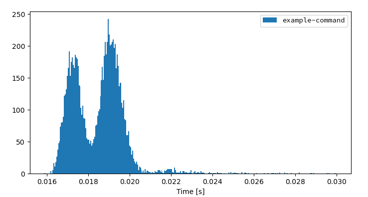
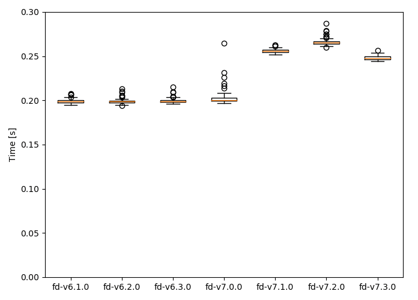
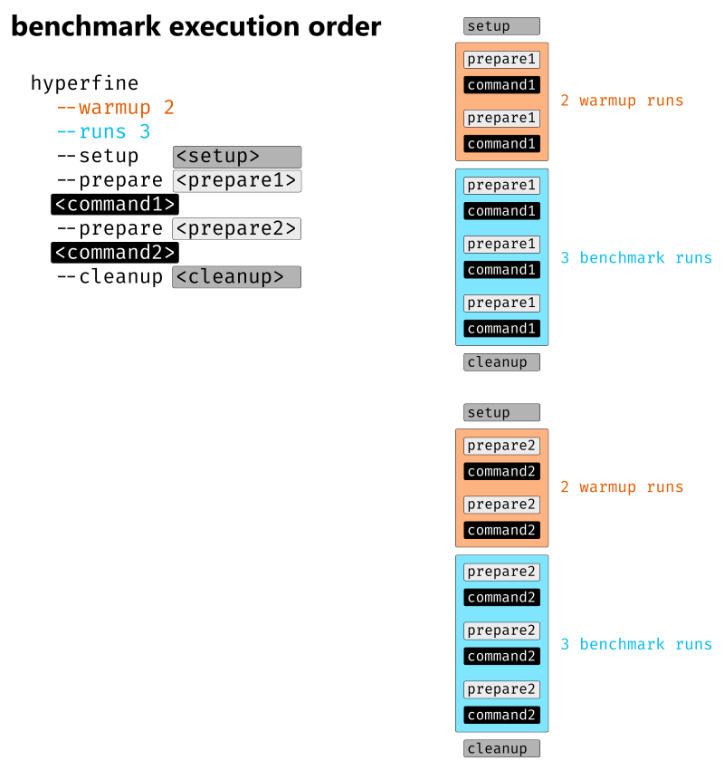

# hyperfine
[](https://github.com/sharkdp/hyperfine/actions/workflows/CICD.yml)
[](https://crates.io/crates/hyperfine)
[中文](https://github.com/chinanf-boy/hyperfine-zh)

A command-line benchmarking tool.

**Demo**: Benchmarking [`fd`](https://github.com/sharkdp/fd) and
[`find`](https://www.gnu.org/software/findutils/):


## Features

* Statistical analysis across multiple runs.
* Support for arbitrary shell commands.
* Constant feedback about the benchmark progress and current estimates.
* Warmup runs can be executed before the actual benchmark.
* Cache-clearing commands can be set up before each timing run.
* Statistical outlier detection to detect interference from other programs and caching effects.
* Export results to various formats: CSV, JSON, Markdown, AsciiDoc.
* Parameterized benchmarks (e.g. vary the number of threads).
* Cross-platform

## Usage

### Basic benchmarks

To run a benchmark, you can simply call `hyperfine <command>...`. Each argument is an executable
and its arguments. Commands run directly by default; use `-S` for shell syntax such as
pipes, redirections, and wildcards. For example:
```sh
hyperfine 'sleep 0.3'
```

Hyperfine will automatically determine the number of runs to perform for each command. By default,
it will perform *at least* 10 benchmarking runs and estimate a run count targeting roughly
3 seconds, including shell overhead and preparation and conclusion commands. To set an exact
number of runs, you can use the `-r`/`--runs` option:
```sh
hyperfine --runs 5 'sleep 0.3'
```

If you want to compare the runtimes of different programs, you can pass multiple commands:
```sh
hyperfine 'hexdump file' 'xxd file'
```

### Warmup runs and preparation commands

For programs that perform a lot of disk I/O, the benchmarking results can be heavily influenced
by disk caches and whether they are cold or warm.

If you want to run the benchmark on a warm cache, you can use the `-w`/`--warmup` option to
perform a certain number of program executions before the actual benchmark:
```sh
hyperfine -S --warmup 3 'grep -R TODO *'
```

Conversely, if you want to run the benchmark for a cold cache, you can use the `-p`/`--prepare`
option to run a special command before *each* timing run. For example, to clear Linux filesystem caches,
you can run
```sh
sync; echo 3 | sudo tee /proc/sys/vm/drop_caches
```
To use this specific command with hyperfine, call `sudo -v` to temporarily gain sudo permissions
and then call:
```sh
hyperfine -S --prepare 'sync; echo 3 | sudo tee /proc/sys/vm/drop_caches' 'grep -R TODO *'
```

### Parameterized benchmarks

If you want to run a series of benchmarks where a single parameter is varied (say, the number of
threads), you can use the `-P`/`--parameter-scan` option and call:
```sh
hyperfine --prepare 'make clean' --parameter-scan num_threads 1 12 'make -j {num_threads}'
```
This also works with decimal numbers. The `-D`/`--parameter-step-size` option can be used
to control the step size:
```sh
hyperfine --parameter-scan delay 0.3 0.7 -D 0.2 'sleep {delay}'
```
This runs `sleep 0.3`, `sleep 0.5` and `sleep 0.7`.

For non-numeric parameters, you can also supply a list of values with the `-L`/`--parameter-list`
option:
```
hyperfine -L compiler g++,clang++ '{compiler} -O2 main.cpp'
```

A common use case is comparing the same command across multiple Git branches. Use `--setup`
to switch branches once before each set of timing runs, so the branch switch is not part of
the measured command:
```sh
hyperfine \
    --parameter-list branch main,performance-improvements \
    --setup 'git switch {branch}' \
    'python main.py'
```

If you need a unique value for each individual run of a benchmark command, hyperfine also exposes
the zero-based `$HYPERFINE_ITERATION` environment variable inside the benchmarked command itself:
```sh
hyperfine -S 'my-command > output-${HYPERFINE_ITERATION}.log'
```

### Intermediate shell

By default, commands are executed directly, without an intermediate shell (`--shell=none`).
Arguments are split using shell-like quoting, so quoted arguments containing spaces are supported.
Shell syntax such as pipes, redirections, environment-variable expansion, `*`, and `~` is not interpreted.
This avoids shell startup overhead and the noise from correcting for it, especially for fast commands
(< 5 ms).

To enable shell syntax, use `-S` (an alias for `--shell=default`). This selects `sh`
on Unix (resolved through `PATH`) or `cmd.exe` on Windows:
```sh
hyperfine -S 'sleep 0.1 && echo done'
```

You can also select a specific shell with `--shell <SHELL>`:
```sh
hyperfine --shell zsh 'for i in {1..10000}; do echo test; done'
```

The shell setting applies to all commands, including `--setup`, `--prepare`, `--conclude`, and `--cleanup`.
If any of these commands need shell syntax, enable a shell explicitly.

When a shell is enabled, hyperfine *corrects for the shell spawning time*. It runs the shell with an
empty command multiple times to measure its startup time, then subtracts this time from each
measurement.


### Shell functions

If you are using bash, you can export shell functions to directly benchmark them with hyperfine:

```bash
my_function() { sleep 1; }
export -f my_function
hyperfine --shell=bash my_function
```

Otherwise, inline the function into the benchmarked command:

```sh
hyperfine -S 'my_function() { sleep 1; }; my_function'
```

### Exporting results

Hyperfine has multiple options for exporting benchmark results to CSV, JSON, Markdown and other
formats (see `--help` text for details).

#### Markdown

You can use the `--export-markdown <file>` option to create tables like the following:

| Command | Mean [s] | Min [s] | Max [s] | Relative |
|:---|---:|---:|---:|---:|
| `find . -iregex '.*[0-9]\.jpg$'` | 2.275 ± 0.046 | 2.243 | 2.397 | 9.79 ± 0.22 |
| `find . -iname '*[0-9].jpg'` | 1.427 ± 0.026 | 1.405 | 1.468 | 6.14 ± 0.13 |
| `fd -HI '.*[0-9]\.jpg$'` | 0.232 ± 0.002 | 0.230 | 0.236 | 1.00 |

#### JSON

The JSON export includes the following metrics for each measured run (excluding warmup runs):

- **`time_wall_clock`**: Time from start to finish, including time spent waiting, in seconds.

- **`time_user`**: CPU time spent running the program's code, summed across threads, in seconds.

  - Linux/macOS: Includes child-process time when parents wait for their children to finish.
  - Windows: Includes the command and its child processes.

- **`time_system`**: CPU time spent running operating-system code for the program, for example
  to read files, summed across threads, in seconds.

  - Linux/macOS: Includes child-process time when parents wait for their children to finish.
  - Windows: Includes the command and its child processes.

- **`memory_peak_resident`**: Peak memory held in physical RAM, in bytes.

  - Linux/macOS: Peak resident set size (RSS). This is the largest per-process peak among the
    command and child processes (whose usage is collected when their parents wait for them),
    *not the simultaneous total memory of the full process tree*.
  - Windows: Currently not supported.

- **`cpu_cycles`**: CPU cycles consumed.

  - Linux: Includes threads and child processes, but excludes kernel and hypervisor execution.
  - macOS: Includes the process's threads and kernel execution, but excludes child processes.
  - Windows: Currently not supported.

- **`instructions`**: Completed CPU instructions.

  - Linux/macOS: Same scope as `cpu_cycles`.
  - Windows: Currently not supported.

- **`cache_references`**: Cache accesses counted by the CPU's generic cache event.

  - Linux: Same scope as `cpu_cycles`. Cache-event definitions depend on the CPU.
  - macOS/Windows: Currently not supported.

- **`cache_misses`**: Cache misses.

  - Linux: Same scope as `cpu_cycles`. Cache-event definitions depend on the CPU.
  - macOS/Windows: Currently not supported.

- **`branch_misses`**: Mispredicted branches.

  - Linux: Same scope as `cpu_cycles`.
  - macOS/Windows: Currently not supported.

Hardware counters are not available if a `--shell` is used.

The JSON output is useful if you want to analyze the benchmark results in more detail. The
[`scripts/`](https://github.com/sharkdp/hyperfine/tree/master/scripts) folder includes a lot
of helpful Python programs to further analyze benchmark results and create helpful
visualizations, like a histogram of runtimes or a whisker plot to compare
multiple benchmarks:

|  |  |
|---:|---:|


### Detailed benchmark flowchart

The following chart explains the execution order of various timing runs when using options
like `--warmup`, `--prepare <cmd>`, `--setup <cmd>` or `--cleanup <cmd>`:



## Installation

[](https://repology.org/project/hyperfine/versions)

### On Ubuntu

On Ubuntu, hyperfine can be installed [from the official repositories](https://launchpad.net/ubuntu/+source/rust-hyperfine):
```
apt install hyperfine
```

Alternatively, for the latest version, you can download the appropriate `.deb` package from the [Release page](https://github.com/sharkdp/hyperfine/releases) and install it via `dpkg`:
```
wget https://github.com/sharkdp/hyperfine/releases/download/v1.21.0/hyperfine_1.21.0_amd64.deb
sudo dpkg -i hyperfine_1.21.0_amd64.deb
```

### On Fedora

On Fedora, hyperfine can be installed from the official repositories:

```sh
dnf install hyperfine
```

### On Alpine Linux

On Alpine Linux, hyperfine can be installed [from the official repositories](https://pkgs.alpinelinux.org/packages?name=hyperfine):
```
apk add hyperfine
```

### On Arch Linux

On Arch Linux, hyperfine can be installed [from the official repositories](https://archlinux.org/packages/extra/x86_64/hyperfine/):
```
pacman -S hyperfine
```

### On Debian Linux

On Debian Linux, hyperfine can be installed [from the official repositories](https://packages.debian.org/hyperfine):
```
apt install hyperfine
```

### On Exherbo Linux

On Exherbo Linux, hyperfine can be installed [from the rust repositories](https://gitlab.exherbo.org/exherbo/rust/-/tree/master/packages/sys-apps/hyperfine):
```
cave resolve -x repository/rust
cave resolve -x hyperfine
```

### On NixOS

On NixOS, hyperfine can be installed [from the official repositories](https://nixos.org/nixos/packages.html?query=hyperfine):
```
nix-env -i hyperfine
```

### On Flox

On Flox, hyperfine can be installed as follows.
```
flox install hyperfine
```
Hyperfine's version in Flox follows that of Nix.

### On openSUSE

On openSUSE, hyperfine can be installed [from the official repositories](https://software.opensuse.org/package/hyperfine):
```
zypper install hyperfine
```

### On Void Linux

Hyperfine can be installed via xbps

```
xbps-install -S hyperfine
```

### On macOS

Hyperfine can be installed via [Homebrew](https://brew.sh):
```
brew install hyperfine
```

Or you can install using [MacPorts](https://www.macports.org):
```
sudo port selfupdate
sudo port install hyperfine
```

### On FreeBSD

Hyperfine can be installed via pkg:
```
pkg install hyperfine
```

### On OpenBSD

```
doas pkg_add hyperfine
```

### On Windows

Hyperfine can be installed via [Chocolatey](https://community.chocolatey.org/packages/hyperfine), [Scoop](https://scoop.sh/#/apps?q=hyperfine&s=0&d=1&o=true&id=8f7c10f75ecf5f9e42a862c615257328e2f70f61), or [Winget](https://github.com/microsoft/winget-pkgs/tree/master/manifests/s/sharkdp/hyperfine):
```
choco install hyperfine
```
```
scoop install hyperfine
```
```
winget install hyperfine
```

### With conda

Hyperfine can be installed via [`conda`](https://conda.io/en/latest/) from the [`conda-forge`](https://anaconda.org/conda-forge/hyperfine) channel:
```
conda install -c conda-forge hyperfine
```

### With cargo (Linux, macOS, Windows)

Hyperfine can be installed from source via [cargo](https://doc.rust-lang.org/cargo/):
```
cargo install --locked hyperfine
```

Make sure that you use Rust 1.97 or newer.

### From binaries (Linux, macOS, Windows)

Download the corresponding archive from the [Release page](https://github.com/sharkdp/hyperfine/releases).

## Alternative tools

Hyperfine is inspired by [bench](https://github.com/Gabriella439/bench).

## Integration with other tools

[Chronologer](https://github.com/dandavison/chronologer) is a tool that uses `hyperfine` to
visualize changes in benchmark timings across your Git history.

[Bencher](https://github.com/bencherdev/bencher) is a continuous benchmarking tool that supports `hyperfine` to
track benchmarks and catch performance regressions in CI.

Drop hyperfine JSON outputs onto the [Venz](https://try.venz.dev) chart to visualize the results,
and manage hyperfine configurations.

Make sure to check out the [`scripts` folder](https://github.com/sharkdp/hyperfine/tree/master/scripts)
in this repository for a set of tools to work with `hyperfine` benchmark results.

## Origin of the name

The name *hyperfine* was chosen in reference to the hyperfine levels of caesium 133 which play a crucial role in the
[definition of our base unit of time](https://en.wikipedia.org/wiki/Second#History_of_definition)
— the second.

## Citing hyperfine

Thank you for considering citing hyperfine in your research work. Please see the information
in the sidebar on how to properly cite hyperfine.

## License

`hyperfine` is dual-licensed under the terms of the MIT License and the Apache License 2.0.

See the [LICENSE-APACHE](LICENSE-APACHE) and [LICENSE-MIT](LICENSE-MIT) files for details.
